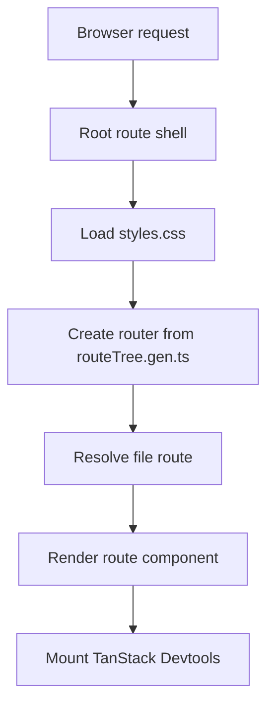
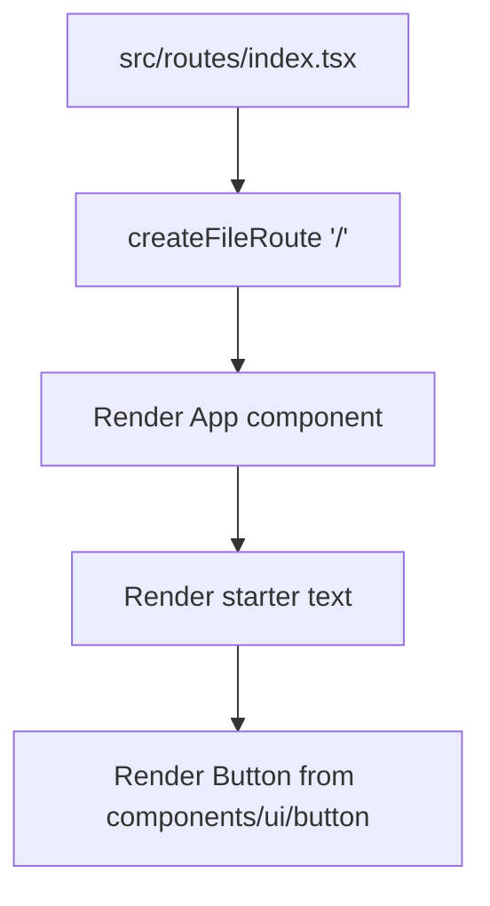
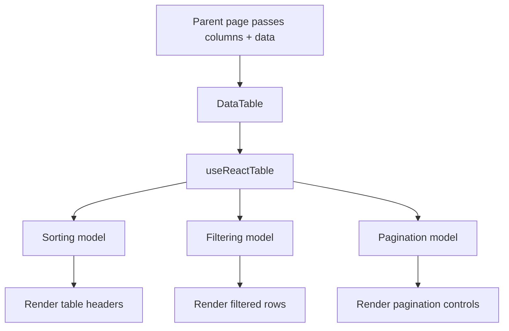

# Flow Diagrams — Funnel Flow

## 1. Alur Boot Aplikasi

```mermaid
flowchart TD
  A[Browser request] --> B[Root route shell]
  B --> C[Load styles.css]
  C --> D[Create router from routeTree.gen.ts]
  D --> E[Resolve file route]
  E --> F[Render route component]
  F --> G[Mount TanStack Devtools]
```

## 2. Alur Render Route `/`

```mermaid
flowchart TD
  A[src/routes/index.tsx] --> B[createFileRoute '/']
  B --> C[Render App component]
  C --> D[Render starter text]
  D --> E[Render Button from components/ui/button]
```

## 3. Alur Reusable `DataTable`

```mermaid
flowchart TD
  A[Parent page passes columns + data] --> B[DataTable]
  B --> C[useReactTable]
  C --> D[Sorting model]
  C --> E[Filtering model]
  C --> F[Pagination model]
  D --> G[Render table headers]
  E --> H[Render filtered rows]
  F --> I[Render pagination controls]
```
